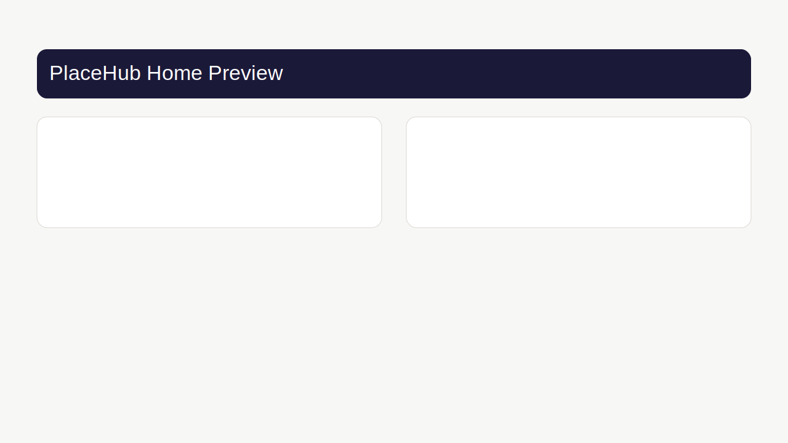
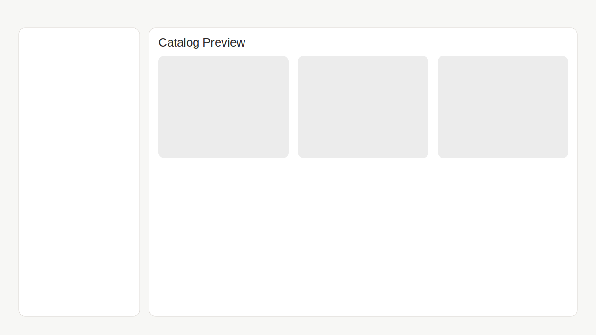
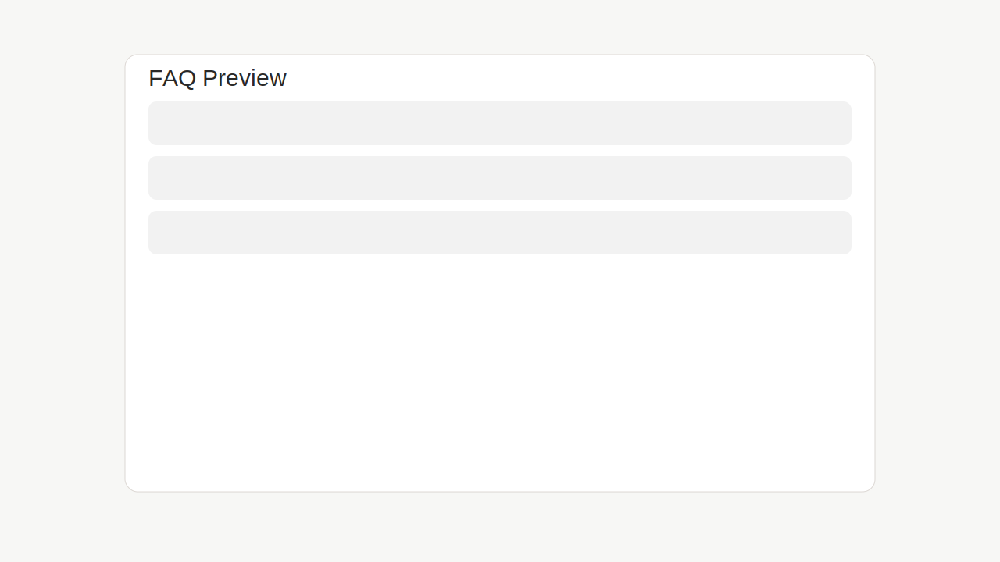

# PlaceHub

PlaceHub — многостраничный веб-сервис для подбора и бронирования городских пространств (коворкинги, переговорные, фотостудии, лофты, event-площадки).

## Что реализовано

- Next.js 14 (App Router) + TypeScript + Tailwind.
- Каталог площадок с фильтрацией и сортировкой.
- Карточки площадок, страница конкретной площадки, подборки.
- Калькулятор аренды и дополнительные услуги.
- FAQ-страница с раскрывающимися ответами.
- RU/EN переключение интерфейса.
- Состояние каталога и избранное через Zustand + localStorage.

## Стек

- **Framework:** Next.js 14
- **Language:** TypeScript (`strict`)
- **Styling:** Tailwind CSS
- **State:** Zustand
- **Forms/validation:** React Hook Form + Zod

## Структура проекта

```txt
src/
  app/
    page.tsx
    catalog/
    collections/
    faq/
    pricing/
    for-owners/
    about/
    contacts/
  components/
    layout/
    catalog/
    sections/
    i18n/
    ui/
  data/
  hooks/
  lib/
  store/
  types/
```

## Запуск

```bash
pnpm install
pnpm dev
```

После запуска приложение доступно на `http://localhost:3000`.

## Проверки

```bash
pnpm typecheck
pnpm lint
```

## Скриншоты

> Изображения лежат в `/docs/screenshots`.

### Главная



### Каталог



### FAQ



## Дорожная карта

- Улучшить визуальные состояния загрузки изображений.
- Добавить e2e-тесты основных пользовательских сценариев.
- Подключить реальный API бронирования.
