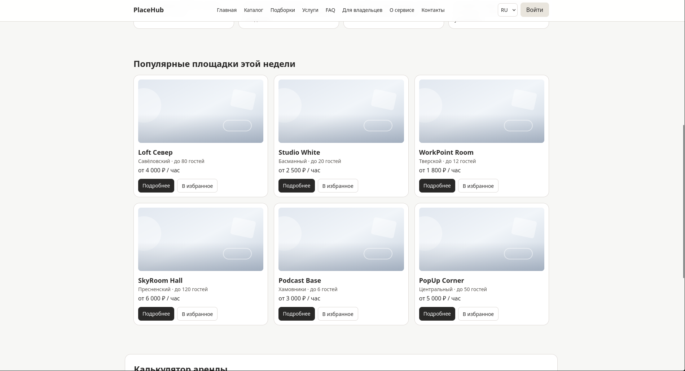
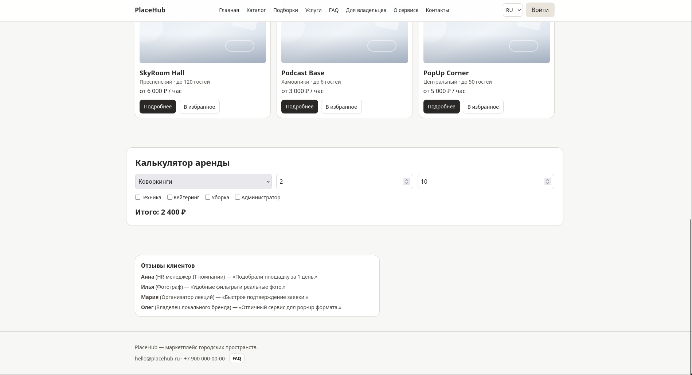
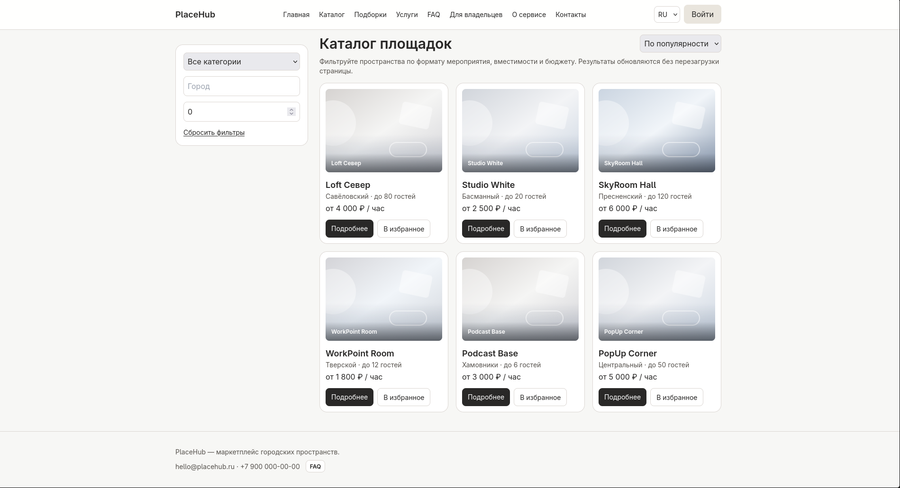
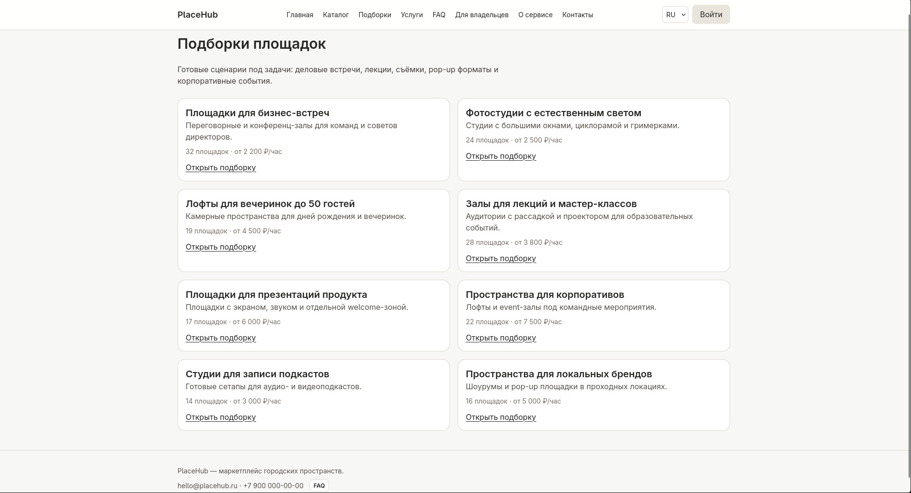
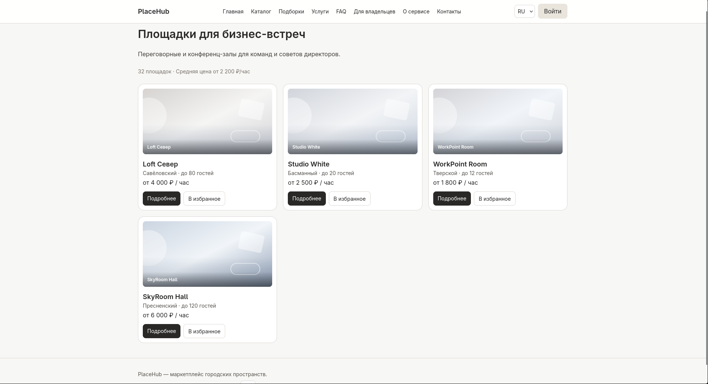
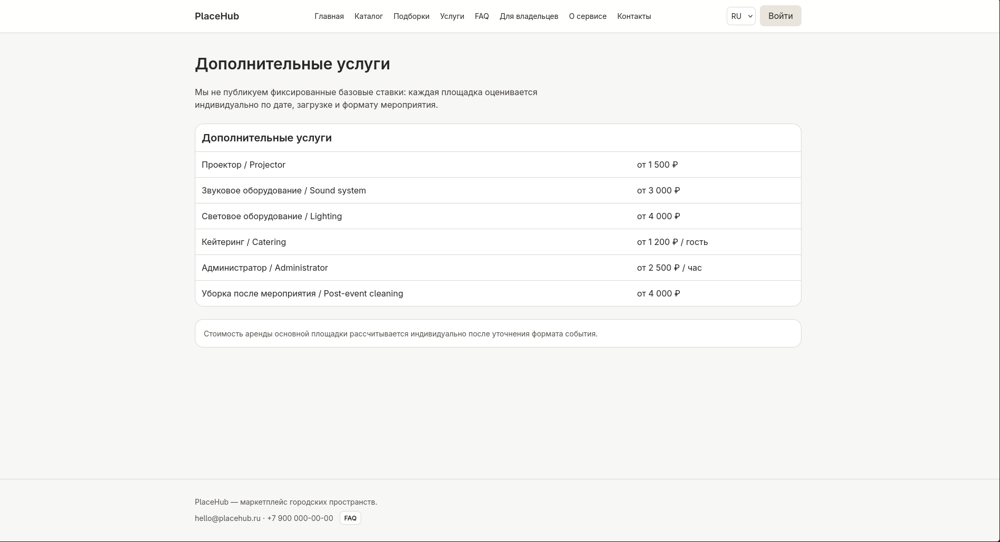
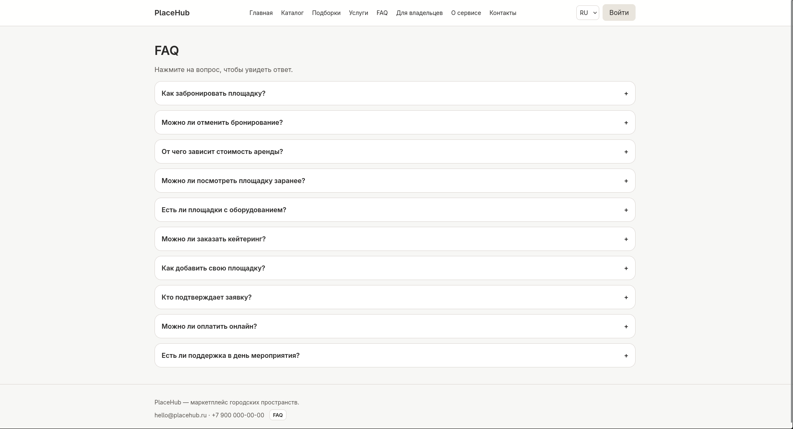
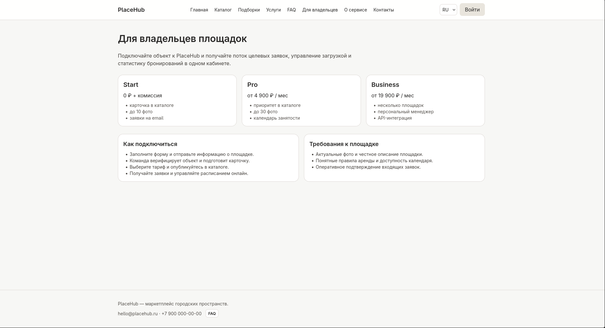
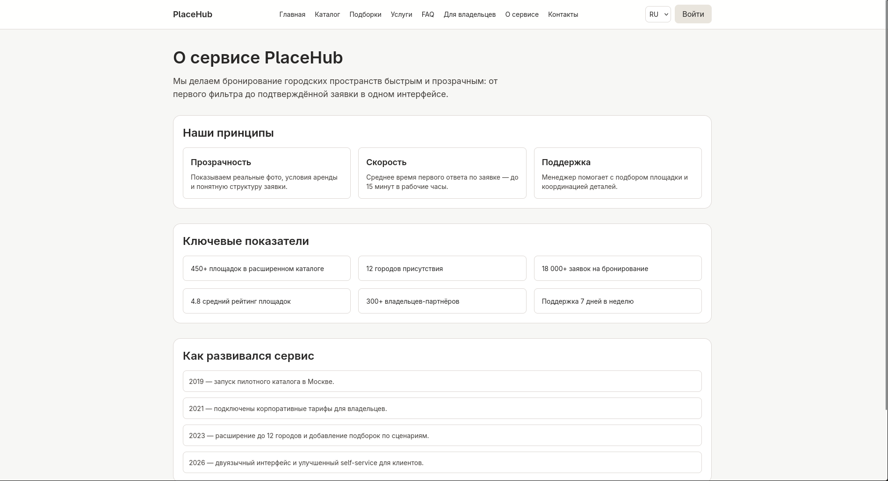
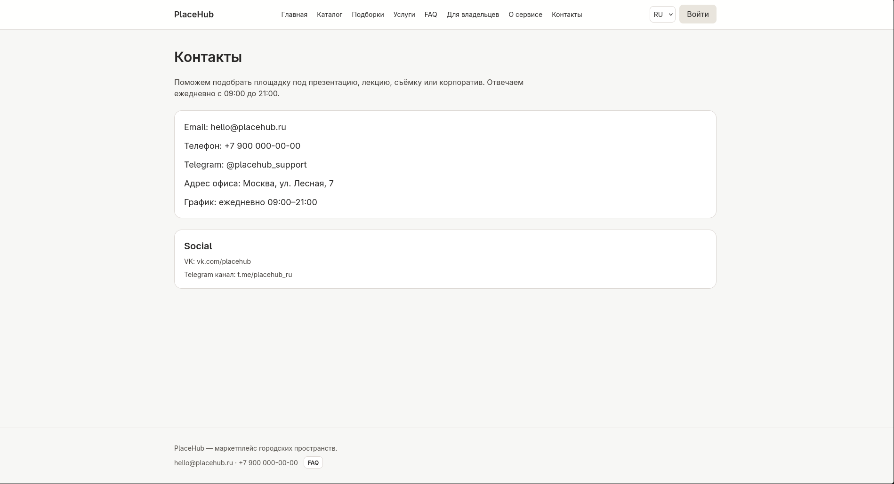

# PlaceHub

PlaceHub — это портфолио-проект в формате коммерческого веб-сервиса для подбора и бронирования городских пространств: коворкингов, переговорных, фотостудий, лофтов и event-площадок.

Проект демонстрирует, как может выглядеть и работать MVP маркетплейса площадок: от первого поиска до отправки заявки, с фильтрацией каталога, страницами объектов, калькулятором стоимости, FAQ и разделом для владельцев.

---

## Смысл проекта

У PlaceHub две целевые аудитории:

1. **Клиенты** (организаторы мероприятий, команды, частные пользователи)
   - быстро находят подходящую площадку;
   - сравнивают варианты по параметрам;
   - понимают ориентировочную стоимость;
   - отправляют заявку без долгой переписки.

2. **Владельцы площадок**
   - изучают условия размещения;
   - выбирают подходящий тариф;
   - отправляют заявку на подключение к сервису.

Идея проекта — показать чистую и понятную UX-модель «marketplace + booking», с фокусом на удобство поиска, прозрачность условий и презентабельный UI.

---

## Полный функционал

### 1) Главная страница (`/`)

- Hero-блок с CTA и переходами в каталог/раздел владельцев.
- Блок о сервисе.
- Блок «как это работает» (этапы в карточках).
- Сетка популярных площадок.
- Калькулятор аренды (часы, гости, услуги).
- Отзывы клиентов.
- FAQ-кнопка в нижней части сайта (в футере).

### 2) Каталог (`/catalog`)

- Левый фильтр-панель:
  - категория;
  - город;
  - количество гостей;
  - сброс фильтров.
- Сортировка:
  - популярность;
  - цена ↑/↓;
  - рейтинг;
  - вместимость.
- Карточки площадок с:
  - названием;
  - районом;
  - ценой;
  - вместимостью;
  - избранным;
  - переходом на страницу площадки.

### 3) Страница площадки (`/catalog/[slug]`)

- Основная информация об объекте.
- Параметры, удобства и правила.
- Контекст для бронирования/расчёта.

### 4) Подборки (`/collections`, `/collections/[slug]`)

- Тематические коллекции площадок.
- Переход на детальную подборку.
- Блок релевантных карточек внутри подборки.

### 5) Услуги и ценообразование (`/pricing`)

- Таблица дополнительных услуг.
- Пояснение, что базовая аренда рассчитывается индивидуально.

### 6) FAQ (`/faq`)

- Отдельная FAQ-страница.
- Раскрывающиеся вопросы/ответы (аккордеон).

### 7) Для владельцев (`/for-owners`)

- Описание ценности сервиса для владельцев.
- Тарифы размещения.
- Шаги подключения и требования.

### 8) О сервисе (`/about`)

- Миссия PlaceHub.
- Принципы работы.
- Ключевые метрики.
- Таймлайн развития.

### 9) Контакты (`/contacts`)

- Контактные данные.
- Каналы связи.
- Социальные ссылки.

### 10) Общие UI-функции

- Переключение языка интерфейса RU/EN.
- Модальное окно входа.
- Липкая шапка.
- Адаптивная сетка страниц.

### 11) Клиентская логика

- `useCalculator` + `calculatePrice` для расчёта стоимости.
- `useVenueFilters` + `filters` для фильтрации/сортировки.
- `useFavourites` для избранного через `localStorage`.
- Zustand store для состояния каталога.

### 12) API-заглушка

- `POST /api/booking` возвращает `{ ok: true }` как минимальная точка интеграции.

---

## Технологии

- **Next.js 14** (App Router)
- **TypeScript**
- **Tailwind CSS**
- **Zustand**
- **React Hook Form + Zod**
- **Framer Motion** (подключён в зависимостях как базис для анимаций)

---

## Архитектура (кратко)

```txt
src/
  app/                 # маршруты Next.js
  components/          # UI и составные блоки
  data/                # контент и данные
  hooks/               # клиентские хуки
  lib/                 # бизнес-логика и утилиты
  store/               # глобальный state (zustand)
  types/               # TS-типы домена
```

Проект построен по принципу разделения ответственности:

- данные в `src/data`;
- бизнес-логика в `src/lib`;
- UI в `src/components`;
- состояние и эффекты в `hooks/store`.

---

## Локальный запуск

### Требования

- Node.js 18+
- pnpm 8+

### Шаги

```bash
# 1) Установка зависимостей
pnpm install

# 2) Запуск dev-сервера
pnpm dev
```

Открой в браузере: `http://localhost:3000`.

### Production-сборка локально

```bash
pnpm build
pnpm start
```

---

## Проверки кода

```bash
# Проверка типов
pnpm typecheck

# ESLint
pnpm lint
```

---

## Скриншоты

> Папка для скриншотов: `docs/screenshots`.
> Ниже — готовые ссылки. Просто добавь соответствующие файлы.

### Главная





### Каталог




### Площадка


### Подборки




### Услуги



### FAQ



### Для владельцев



### О сервисе и Контакты




---

## Идеи для дальнейшего развития

- Реальный backend для заявок и расписания.
- Онлайн-оплата и статусы заказов.
- Кабинет клиента и владельца площадки.
- E2E-тесты пользовательских сценариев.
- SEO-доработки и контентные сценарии для страниц коллекций.
